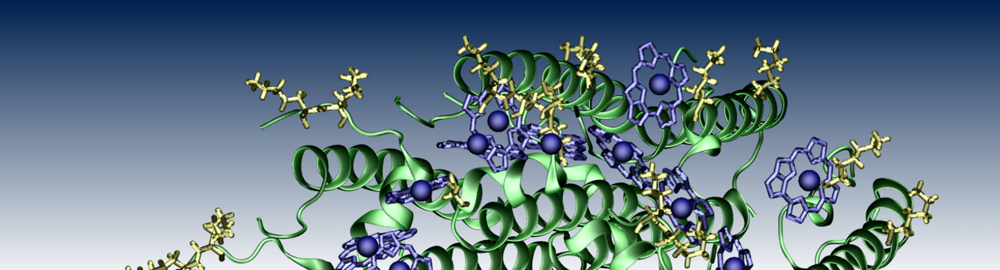

# Glycoprotein prediction with AlphaFold2



## Table of Contents
* [General Overview](#General-Overview)
* [Prerequisites](#Prerequisites)
* [Skript Execution](#Skript-Execution)
* [Additional Information](#Additional-Information)

## General Overview 
This small project was made during my internship by [NyBerMann](https://www.llbschool.org/). The particular task was construction of similar
glycoproteins of Coviruses with later analysis with Autodock. For this point we needed folded structures, which could be found in PDB, but also constructed de-novo with AlphaFold2. Though, this notebook appeared!

## Prerequisites
For running this script some applications are needed. They are: 
-[Biopython](https://biopython.org/)
-[Azure Machine Learning](https://azure.microsoft.com/en-us/products/machine-learning/)
Azure is a complete cloud platform, that has to be initiated (sign up account) and setted up. See hints [here](https://azure.microsoft.com/en-us/products/machine-learning/).
- [py3Dmol](https://pypi.org/project/py3Dmol/)

### Input Files

You also need a "sequences.fasta" file in the directory where the script is located. This file should consist of protein sequences in fasta format.

Example:
```
>reference
FGEVFNATRFASVYAWNRKRISNCVADYSVLYNSASFSTFKCYGVSPTKLNDLCFTNVYADSFVIRGDEVRQIAPGQTGKISNCVADYSVLYNSASFSTFKCYGVS
>alpha
FGEVFNATRFASVYAWNRKRISNCVADYSVLYNSASFSTFKCYGVSPTKLNDLCFTNVYADSFVIRGDEVRQIAPGQTGKIADYNYKLPDDFTGCVIAWNSNNLDS
>delta
FGEVFNATRFASVYAWNRKRISNCVADYSVLYNSASFSTFKCYGVSPTKLNDLCFTNVYADSFVIRGDEVRQIAPGQTGKIADYNYKLPDDFTGCVIAWNSNNLDS
>omicron
FDEVFNATRFASVYAWNRKRISNCVADYSVLYNLAPFFTFKCYGVSPTKLNDLCFTNVYADSFVIRGDEVRQIAPGQTGNIADYNYKLPDDFTGCVIAWNSNKLDS
```

## Skript Execution
First of all you have to handle Azure ML logging steps and then run the notebook. It also time-consuming, thus do not be scared of high time-efforts.

### Results
After all you will have many files in `./results` folder. There would be also models located in `.pdb` format. With py3Dmol you can visualize them
in your code!


## Additional Information

My notebook bases on [Colby T.Ford](https://github.com/colbyford/) notebook and couple of Medium articles.

